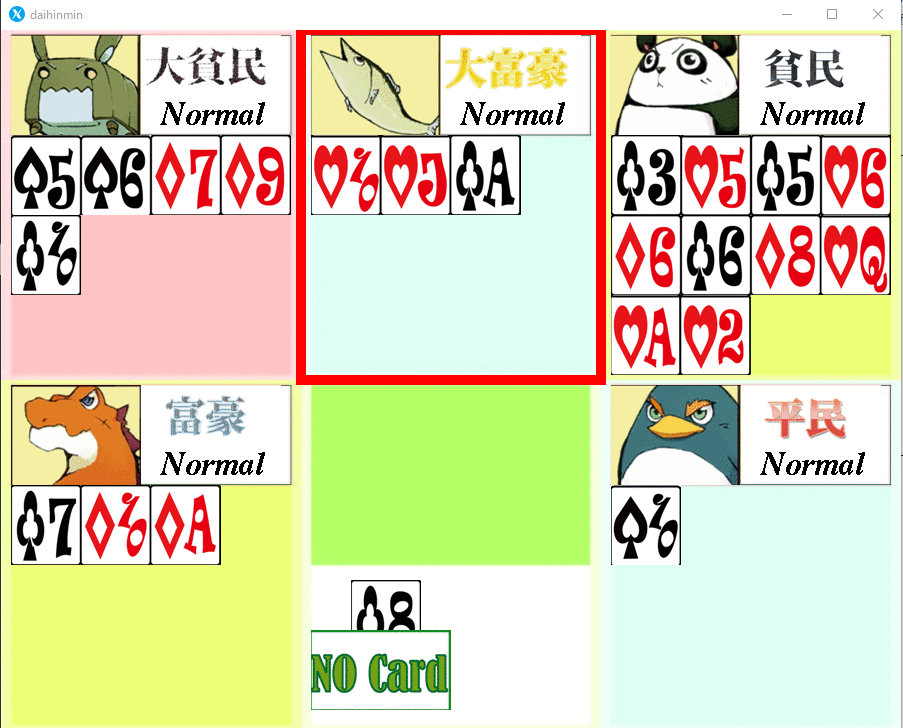
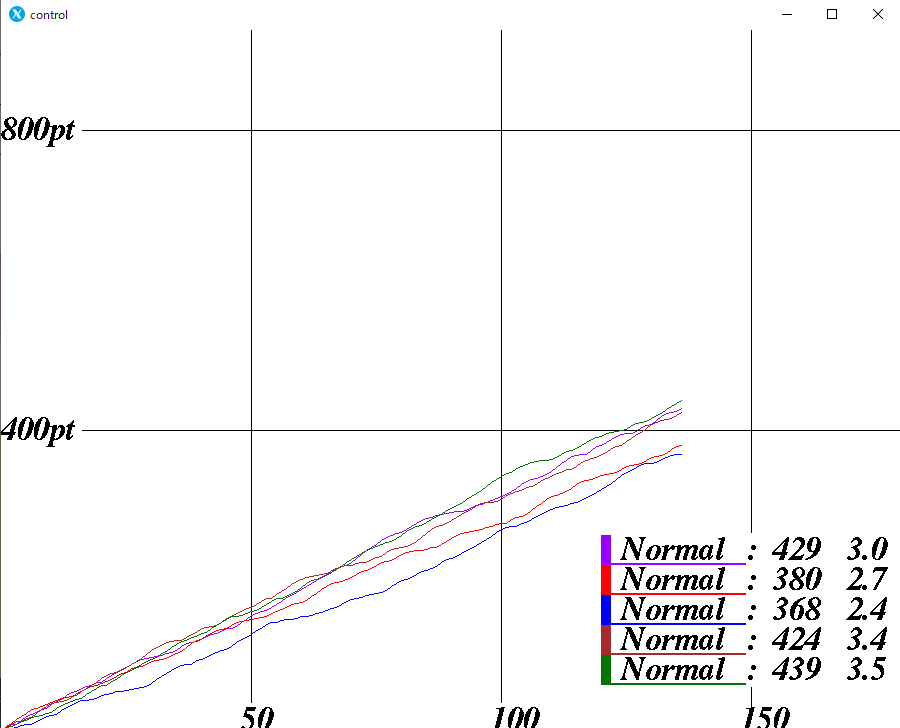
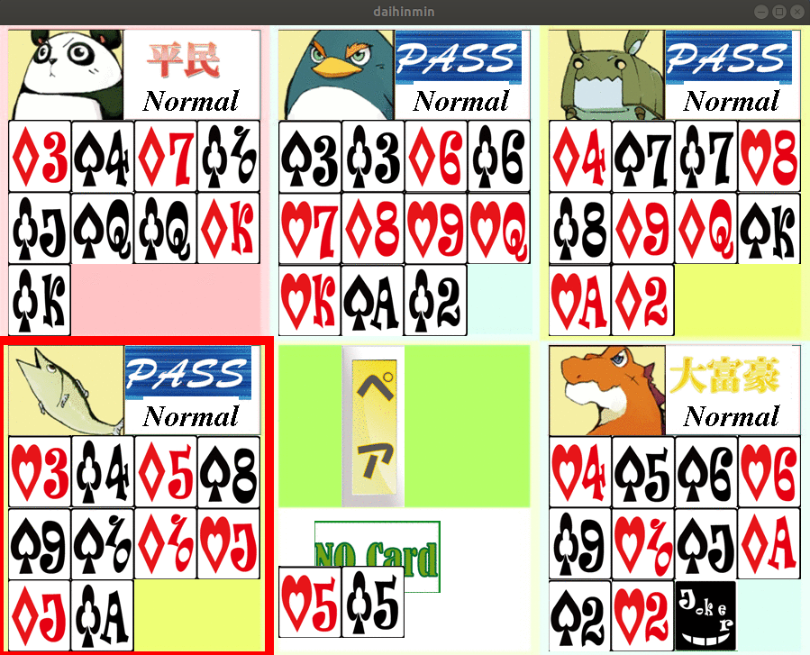

# 課題5

## 対戦画面のスクリーンショット


## グラフのスクリーンショット


# 課題6

## 実装した「ペア出し機能」のソースコード

daihimin.cに下記のコードを追記した

```C
void make_info_table(int info_table[8][15], int my_cards[8][15])
{
	int i;
	clear_table(info_table);
	for (i = 1; i <= 13; i++) {
		info_table[4][i] =
		    my_cards[0][i] + my_cards[1][i] + my_cards[2][i] +
		    my_cards[3][i];
	}
}

int serach_low_pair(int dst_cards[8][15], int info_table[8][15],
		    int my_cards[8][15])
{
	int i, j;
	clear_table(dst_cards);
	for (i = 1; i <= 13; i++) {
		if (info_table[4][i] >= 2)
			break;
	}
	if (i <= 13) {
		for (j = 0; j <= 3; j++)
			dst_cards[j][i] = my_cards[j][i];
		return 1;
	} else
		return 0;
}
```

daihimin.hに下記のコードを追記した

```C
void make_info_table(int info_table[8][15], int my_cards[8][15]);

int serach_low_pair(int dst_cards[8][15], int info_table[8][15],
		    int my_cards[8][15]);
```

select_cards.cのselect_cards_free()を次のように修正した

```C
void select_cards_free(int select_cards[8][15], int my_cards[8][15], state *field_status){
	int info_table[8][15];

	make_info_table(info_table,my_cards);
	if(count_cards(select_cards)==0)
		serach_low_pair(select_cards,info_table,my_cards);
	if(count_cards(select_cards)==0)
		search_low_card(select_cards,my_cards,0); // 手持ちの一番弱いカードを単騎で提出する
}
```

## ソースコードについての考察

1. 配列をどのように使って処理をしているか

　make_info_table()において、新たに配列を作成している。この配列は、手札を示す配列からジョーカーを除く一般のカードで同じ数字のものの枚数を記録するために使われている。この配列を使用することによって、既存の手札を示す配列・場を示す配列などを汚すことなく、ペアが成立するものを探すことが可能となっている。

2. そのソースコードの記述によって何故その機能が実現できているか

　まず、select_cards.cへの記述によって実際に、場にカードがない状況においてペアが成立する手札を探し、あった場合は出すことができるようになっている。
　また、daihinmin.cに記述したserach_low_pair()にてあらかじめ計算しておいたペア出し可能な手札から、最も弱いペアを探すことが可能となっている。
　さらに、daihinmin.cに記述したmake_info_table()によってserach_low_pair()でつかう、ペア出し可能な手札、つまり、手札の中から、同じ数字を持ったカードの枚数を記録した配列を作成している。


## ペア出しの様子のわかる実行画面のスクリーンショット

