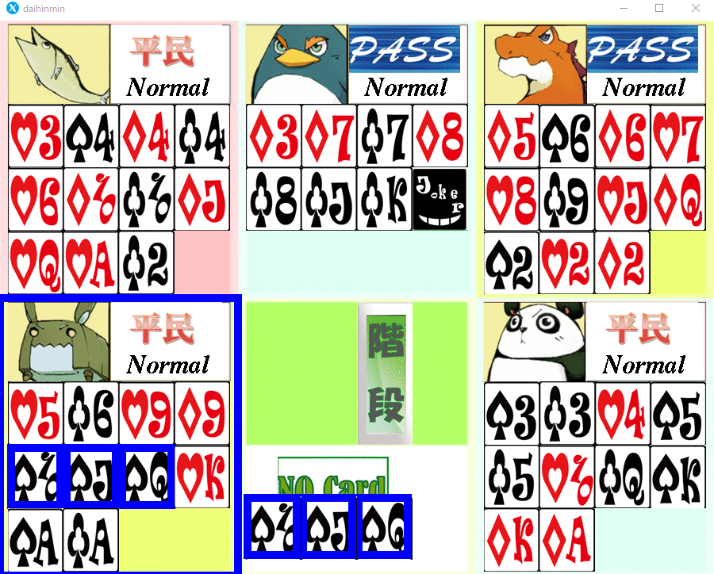
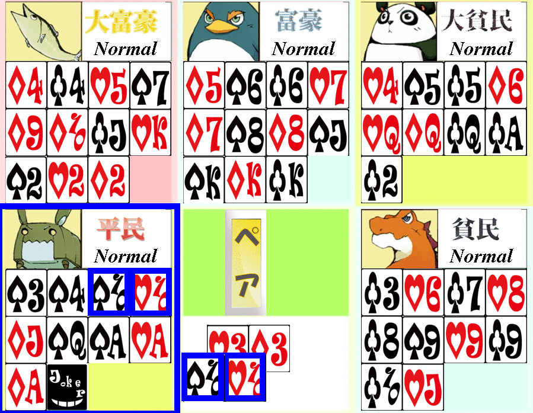
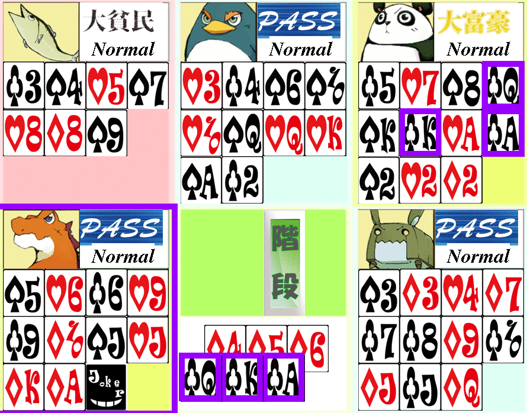
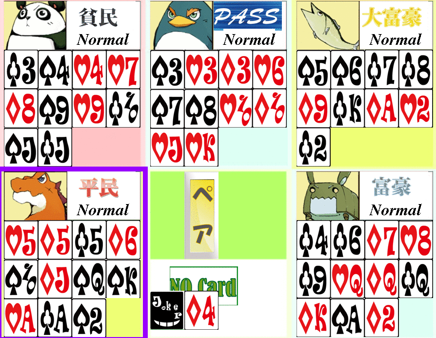

# 課題7

## 場に何もない状態での階段出し機能の実装

### ソースコード

daihinmin.cのmake_info_table()を下記のようにした

```C
void make_info_table(int info_table[8][15], int my_cards[8][15])
{
	int i;
	int j;
	clear_table(info_table);
	//ペア実装用
	for(i = 1;i <= 13;i++)
	{
		info_table[4][i] = my_cards[0][i] + my_cards[1][i] + my_cards[2][i] + my_cards[3][i];
	}
	//階段実装用
	for(j = 0; j <= 3; j++){
		for(i = 13; i >=0 ; i--){
			if(my_cards[j][i] == 1){
				info_table[j][i] = info_table[j][i+1]+1;
			}else if(my_cards[j][i] == 0){
				info_table[j][i] = 0;
			}
		}
	}
	for(j = 0; j <= 3; j++){
		for(i = 0; i <= 13; i++){
			if(info_table[j][i] == 2){
			       info_table[j][i] = 1;
			}
			if(info_table[j][i] == 3){
				printf("detected kaidan\n");
			}
		}
	}
}
```

daihinmin.cのsearch_low_sequence()を下記のようにした

```C
int search_low_sequence(int dst_cards[8][15],int info_table[8][15], int my_cards[8][15])
{
	int i;
	int j;
	clear_table(dst_cards);
	for(j = 0;j < 4; j++)
	{
		for(i = 0;i <= 13;i++)
		{
			if(info_table[j][i] >= 3)
			{
				while(info_table[j][i] > 0){
					dst_cards[j][i] = my_cards[j][i];
					i++;
				}
				return 1;
			}
		}
	}
	return 0;
}
```

daihinmin.hに下記を追記した

```C
int search_low_sequence(int dst_cards[8][15],int info_table[8][15], int my_cards[8][15]);
```

select_cards.cのselect_cards_free()を下記のようにした

```C
void select_cards_free(int select_cards[8][15], int my_cards[8][15], state *field_status){
	int info_table[8][15];

	make_info_table(info_table, my_cards);
	if(count_cards(select_cards) == 0)
 		search_low_sequence(select_cards, info_table, my_cards);
	if(count_cards(select_cards) == 0)
		search_low_pair(select_cards, info_table, my_cards);
	if(count_cards(select_cards) == 0)
 		search_low_card(select_cards,my_cards,0); // 手持ちの一番弱いカードを単騎で提出する
}
```

### 考察

* 配列をどのように使って処理をしているか

　`info_table()`内で作成される配列の各マークにおいて、各カードを起点として何枚のカードを階段として出せるかを保存するようにした。このような処理を実装することによって、各マークを弱いカードから保存されている数のデータが0になるまでは連続であるということがわかる。

* 該当するソースコードの記述によって何故その機能が実現できているのか

　daihinmin.cのmake_info_table()にて、上記の配列を作成している。特に本レポートの `//階段実装用` と記述のあるもの以降が上記の配列を作成するに使用されている。また、階段は2枚では成立しないので2の記述のあるものは1に書き換えている。
　daihinmin.cのsearch_low_sequence()にて、引数として渡されたinfo_table配列をそれぞれのマークごとに弱いカードから順に探索して、3より大きい値が出たら、0になるまで、カードを場に出している。

### スクリーンショット

 

# 課題8

## カードが場にある状態でのペア出し

### ソースコード

作成したコードは下記のようになった

daihinmin.cのsearch_low_pair_restrict()を下記のようにした

```C
int search_low_pair_restrict(int dst_cards[8][15],int info_table[8][15], int my_cards[8][15], int cards){
	//cards	には指定した枚数が入る
	//指定した枚数のペアをdst_cardsに載せます
	int i;
	int j;
	clear_table(dst_cards);
	for(i = 0;i <= 13; i++){
		if(info_table[4][i] == cards) break;
	}
	if(i <= 13){
		for(j = 0;j<=3;j++) dst_cards[j][i] = my_cards[j][i];
		return 1;
	}
	else return 0;
}
```

daihinmin.hに下記を追記した

```C
int search_low_pair_restrict(int dst_cards[8][15],int info_table[8][15], int my_cards[8][15], int cards);
```

select_cards.cのselect_cards_restrict()を下記のようにした

```C
void select_cards_restrict(int select_cards[8][15], int my_cards[8][15], state *field_status){
  int tmp_cards[8][15];
 
  copy_table(tmp_cards, my_cards); 

	int info_table[8][15];

	make_info_table(info_table, tmp_cards);
  if(field_status->is_sequence==1){ // 場が階段のとき
    if(field_status->is_lock==1){ // 場が縛られている

    }else{ // 場が縛られていない

    }

  }else if(field_status->quantity > 1){ // 場がペアのとき
    if(field_status->is_lock==1){ // 場が縛られている

    }else{ // 場が縛られていない
        remove_low_card(tmp_cards, field_status->order, 0); 
	search_low_pair_restrict(select_cards, info_table, tmp_cards, field_status->quantity);
    }
  }else{ // 場が単騎のとき
    if(field_status->is_lock==1){ // 場が縛られている
      remove_suit(tmp_cards, field_status->suit, 1);
      remove_low_card(tmp_cards, field_status->order, 0); 
      search_low_card(select_cards,tmp_cards,1); 
    }else{ // 場が縛られていない
      remove_low_card(tmp_cards, field_status->order, 0); 
      search_low_card(select_cards,tmp_cards,1); 
    }
  }
}
```

### 考察

* 配列をどのように使って処理をしているか

　info_table配列にてペアができるのものを探索するのは変わらないが、今までは、場にカードが存在していなかったのでペアができる場合は即座に場に出していたが、今回は、場に出ている枚数分と同じ値のものに限定して出すようになっている。

* 該当するソースコードの記述によって何故その機能が実現できているのか

　まず、search_low_pair_restrict()内で、マークごとに弱いカードから順に探索する。この関数の最後尾の率い数は場に出ているカードの枚数なので、それと一致した場合、カードを場に出している。また、select_cards_restrict内で場に出ているカードよりも弱いカードはすべて消されているため、search_low_pair_restrict()内では弱いカードから順に探索するだけでよくなっている。

### スクリーンショット

 

## カードが場にある状態での階段出し

### ソースコード

まず、daihinbim.cに下記を追加した

```C
#include <unistd.h>
```

daihinmin.cのsearch_low_sequence_restrict()を下記のようにした

```C
int search_low_sequence_restrict(int dst_cards[8][15],int info_table[8][15], int my_cards[8][15], int cards)
{
	//cards	には場に出ているカードの枚数が代入されている
	int i;
	int j;
	int first_i;
	clear_table(dst_cards);
	for(j = 0;j < 4; j++)
	{
		for(i = 0;i <= 13;i++)
		{
			if(info_table[j][i] == cards)
			{
				while(info_table[j][i] > 0){
					dst_cards[j][i] = my_cards[j][i];
					i++;
				}
				return 1;
			}
		}
	}
	return 0;
}
```

daihinmin.hに下記を追記した

```C
int search_low_sequence_restrict(int dst_cards[8][15],int info_table[8][15], int my_cards[8][15], int cards);
```

select_cards.cのselect_cards_restrict()を下記のようにした

```C
void select_cards_restrict(int select_cards[8][15], int my_cards[8][15], state *field_status){
  int tmp_cards[8][15];
 
  copy_table(tmp_cards, my_cards); 

	int info_table[8][15];

	make_info_table(info_table, tmp_cards);
  if(field_status->is_sequence==1){ // 場が階段のとき
    if(field_status->is_lock==1){ // 場が縛られている

    }else{ // 場が縛られていない
        remove_low_card(tmp_cards, field_status->order, 0); 
	search_low_sequence_restrict(select_cards, info_table, tmp_cards, field_status->quantity);
    }

  }else if(field_status->quantity > 1){ // 場がペアのとき
    if(field_status->is_lock==1){ // 場が縛られている

    }else{ // 場が縛られていない
        remove_low_card(tmp_cards, field_status->order, 0); 
	      search_low_pair_restrict(select_cards, info_table, tmp_cards, field_status->quantity);
    }
  }else{ // 場が単騎のとき
    if(field_status->is_lock==1){ // 場が縛られている
      remove_suit(tmp_cards, field_status->suit, 1);
      remove_low_card(tmp_cards, field_status->order, 0); 
      search_low_card(select_cards,tmp_cards,1); 
    }else{ // 場が縛られていない
      remove_low_card(tmp_cards, field_status->order, 0); 
      search_low_card(select_cards,tmp_cards,1); 
    }
  }
}
```

### 考察

* 配列をどのように使って処理をしているか

　ペア出しと同様に、場に出ているカードの枚数と同数のものが、各マークごとに弱いカードから順に探索していった場合に出たときに、連番のものを出すようにしている。

* 該当するソースコードの記述によって何故その機能が実現できているのか

　これも、先ほどの場にある状態でのペア出しと同様に、search_low_sequence_restrict()の最後尾の引数に場に出ているカードの枚数が代入されている。したがって、場にカードが出ていない状態のsearch_low_sequence()と異なる部分は、info_table配列を探索する際に、3以上の値が出ても、場に出ているカードの枚数と同じものになるまで場に出すカードの配列に代入しないようになっている。こうすることで、場に出ているカードの枚数と同じ枚数を場に出すことができる。また、select_cards_restrict()にてseqrch_low_sequence_restrict()を実行する前に場に出ているカードよりも弱いカードを消すことによって、search_low_sequence_restrict()では弱いカードから順に探索するだけで済むようになっている。

### スクリーンショット

 

# 課題10

## 場が空の時のジョーカーを利用したペア出し

### ソースコード

daihinmin.cのmake_info_table()を下記のようにした

```C
void make_info_table(int info_table[8][15],int info_j_table[8][15], int my_cards[8][15])
{
	int i;
	int j;
	clear_table(info_table);
	//ペア実装用
	for(i = 1;i <= 13;i++)
	{
		info_table[4][i] = my_cards[0][i] + my_cards[1][i] + my_cards[2][i] + my_cards[3][i];
	}
	//階段実装用
	for(j = 0; j <= 3; j++){
		for(i = 13; i >=0 ; i--){
			if(my_cards[j][i] == 1){
				info_table[j][i] = info_table[j][i+1]+1;
			}else if(my_cards[j][i] == 0){
				info_table[j][i] = 0;
			}
		}
	}
	for(j = 0; j <= 3; j++){
		for(i = 0; i <= 13; i++){
			if(info_table[j][i] == 2){
			       info_table[j][i] = 1;
			}
		}
	}
	//ペアをジョーカー付きで出すよう
	for(i = 0; i <= 13; i++){
		info_j_table[4][i] = info_table[4][i] + 1;
	}
}
```

daihinmin.cのsearch_low_pair_wj()を下記のようにした

```C
int search_low_pair_wj(int dst_cards[8][15],int info_j_table[8][15], int my_cards[8][15]){
	int i;
	int j;
	int used = 0;
	clear_table(dst_cards);
	for(i = 1;i <= 13; i++){
		if(info_j_table[4][i] >= 2) break;
	}
	if(i <= 13){
		for(j = 0;j<=3;j++) {
			if(my_cards[j][i])
				dst_cards[j][i] = my_cards[j][i];
			else if(my_cards[j][i]==0 && !used){
				dst_cards[j][i] = 2;
				used = 1;
			}
		}
		return 1;
	}
	else return 0;
}
```

daihinmin.hに下記を追記した

```C
int search_low_pair_wj(int dst_cards[8][15],int info_j_table[8][15], int my_cards[8][15]);
```

select_cards.cのselect_cards_free()を下記のようにした

```C
void select_cards_free(int select_cards[8][15], int my_cards[8][15], state *field_status){
	int info_table[8][15];
	int info_j_table[8][15];

	make_info_table(info_table,info_j_table, my_cards);
	if(count_cards(select_cards) == 0)
 		search_low_sequence(select_cards, info_table, my_cards);
	if(count_cards(select_cards) == 0)
		search_low_pair_wj(select_cards, info_j_table, my_cards);
	if(count_cards(select_cards) == 0)
 		search_low_card(select_cards,my_cards,0); // 手持ちの一番弱いカードを単騎で提出する
}
```

### 考察

* 配列をどのように使って処理をしているか

　ジョーカーを使用できない場合のペア出しするカード枚数＋1がジョーカーを使用した場合のペア出し枚数である。したがって、info_table配列から、ジョーカーを使用した場合の配列を作成することでジョーカーありの場合を実装することができる。

* 該当するソースコードの記述によって何故その機能が実現できているのか

　make_info_table()にて、ジョーカーを使用した場合の配列info_j_tableをinfo_table配列から作成する。このとき、info_j_table配列に保存する値はinfo_table配列に保存されている値に1を加算した数字である。
　実際に出すには、search_low_pair_wj()を使用している。この関数では、search_low_pair()と異なっている点は、usedというフラグを使用している点と、my_cardsに入れられている値によって分岐処理を使用している点である。usedフラグはジョーカーを使用していない場合は0、使用している状態では1が入るようになっている。さらに、my_cards配列の値が0の場合はジョーカーを入れるようになっている。

### スクリーンショット

 
